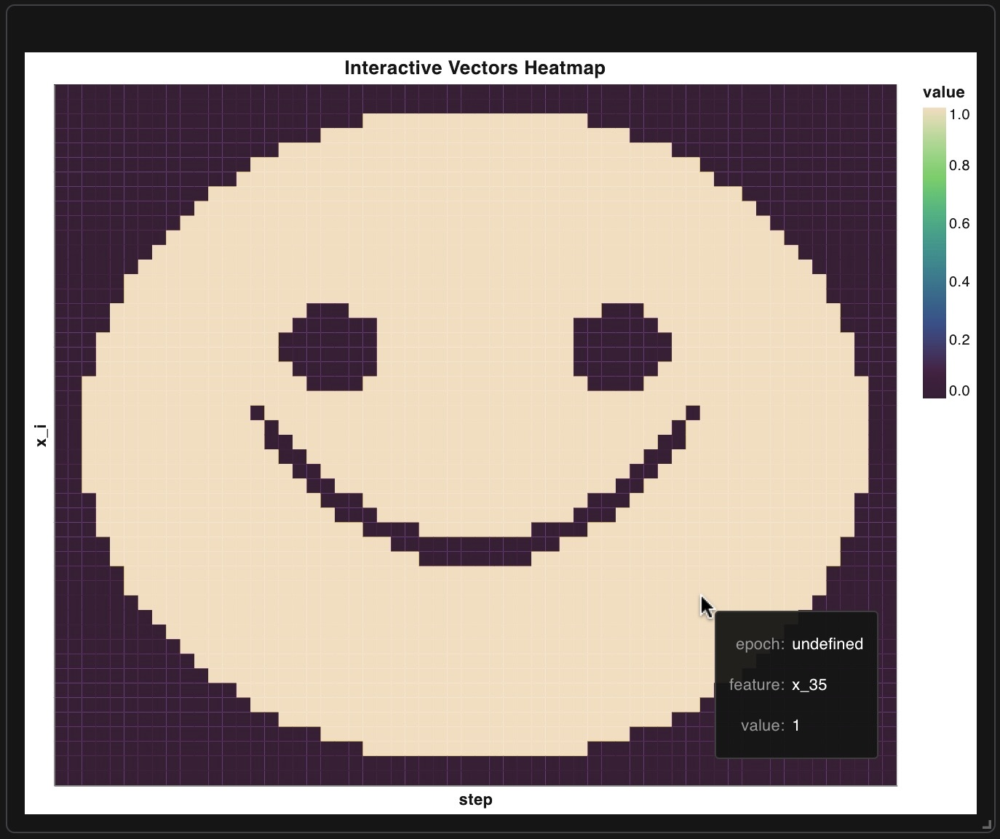
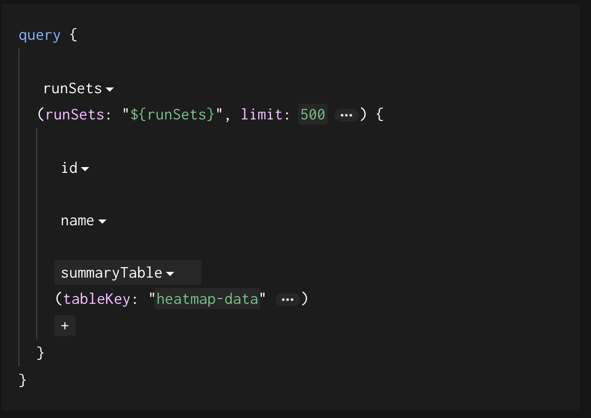

# wandb custom interactive chart 🙂



> [!NOTE]
> what is this code for? *Logging vectors as the training progresses - e.g. final layer logits*


# 🚀 setup

## 🐍 Python setup
### 1. setup the python env
 ```bash
uv sync
```
to download dependencies.

### run the code to initialize the table
```bash
python3 main.py
```

## 🧠 wandb chart setup
1. in the run workspace press *add panels* -> *custom chart*
2. pick a random chart and edit it
3. paste the schema from [wandb-custom-chart/interactive-heatmap.json](wandb-custom-chart/interactive-heatmap.json)
4. press on the 3 dots at the upper right corner and select *save as new preset*
5. return to the *custom chart* window and select the new chart template
6. on the right side of the window - write the query as such

```text
query {
    runSets
    (runSets: "${runSets}", limit: 500 ) {
        
        id
        
        name
        
        summaryTable
        (tableKey: "heatmap-data" )
    }
}
```




> [!IMPORTANT]
> It takes time for the table to show on the wandb dashboard - possibly until all rows are uploaded.


# repo structure

```
src/
├── main.py # run demo
└── utils/
    └── utils_wandb.py # the custom logger
wandb-custom-chart/
└── interactive-heatmap.json # the custom wandb chart json
wandb/
```

# 🔍 Implementation details - appending vectors vs re-logging the entire table on each step
In the implementation you'll notice that new vectors aren't being appended but the entire table being updated on wandb.

> As of writing this, I am not aware of an ability to append rows to a table in wandb (instead of logging the table over and over which obviously is inefficient)

One can of course modify the code to save and update the table locally and sync it to the wandb remote once the run finished..